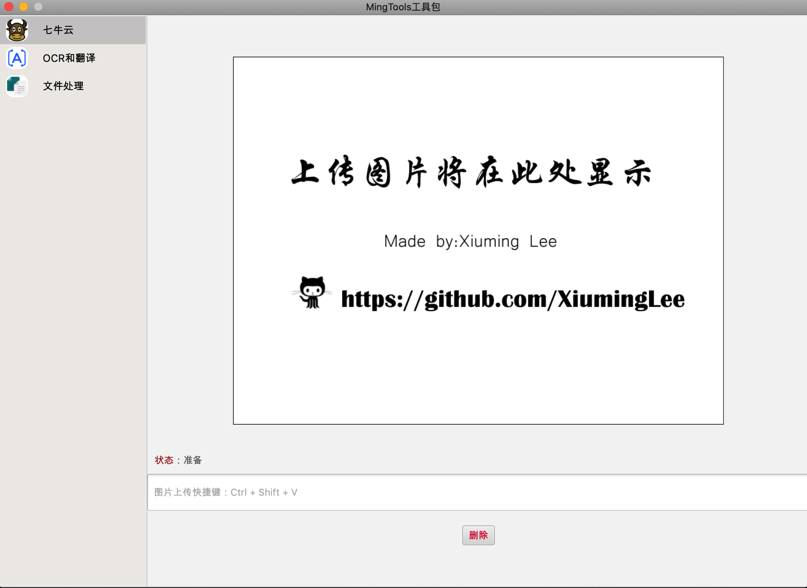
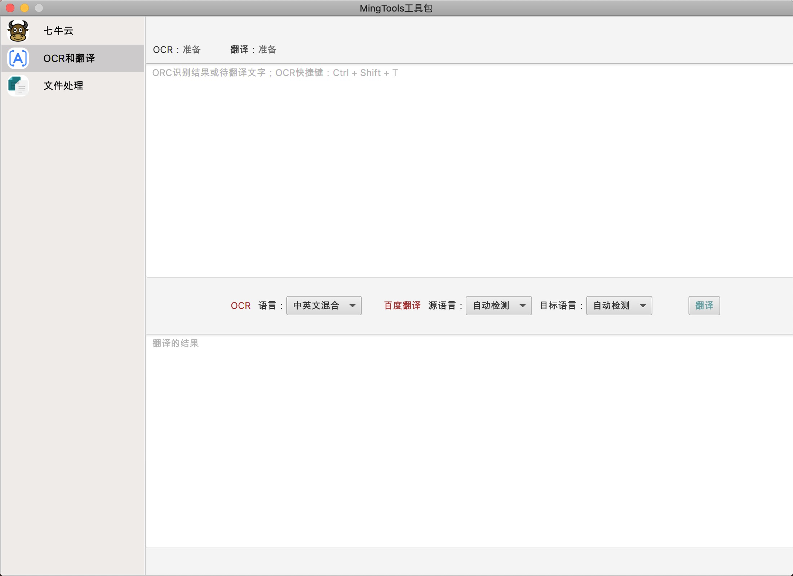
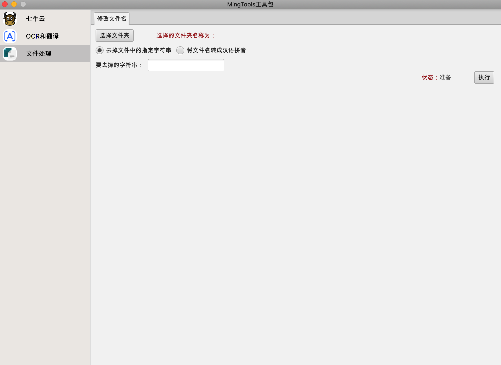

# MingTools
基于Spring Boot、JavaFX的桌面端工具集合，不断完善。

> 适用于 `Mac`、`Windows`和`Linux`。要求Java11及以上版本

## 功能简介

- **七牛云**
  - 图片一键上传 `Ctrl + Shift + V`
  - 图片删除
- **OCR和翻译**
  - 百度图片OCR识别，图片转文字 `Ctrl + Shift + T`
  - 百度翻译
- **文件处理**
  - 批量修改文件名称，取出文件中的指定字符串
  - 将文件名修改为汉语拼音。

## 功能预览




## 功能使用

> 在使用`七牛云`和`OCR和翻译`功能时，需要到相应的网站获取自己的应用key和秘钥。

- #### 七牛云

创建存储空间：https://developer.qiniu.com/kodo/manual/1233/console-quickstart

自己的秘钥：https://portal.qiniu.com/user/key

- #### OCR

在以下网站创建应用，并获取`API Key` 和`Secret Key`

https://console.bce.baidu.com/ai/#/ai/ocr/app/list

- #### 翻译

在以下网站获取`APP ID`和`秘钥`

https://fanyi-api.baidu.com/api/trans/product/desktop?req=developer

将以上key和秘钥填写到`application.yaml`配置文件中

```yaml
ming:
  tools:
    baidu:
      access-ocr-key: Your 百度OCR accessKey
      secret-ocr-key: Your 百度OCR secretKey
      access-trans-key: Your 百度翻译 accessKey  APP ID
      secret-trans-key: Your 百度翻译 secretKey
    qiniu:
      access-key: Your 七牛云 accessKey
      secret-key: Your 七牛云 secretKey
      bucket-name: 要上传到的空间
      file-path-prefix: 文件地址前缀，cdn地址
```

> `注意：`不使用的功能，可以不填写为自己的key和秘钥，但是不要删除或置为空。

